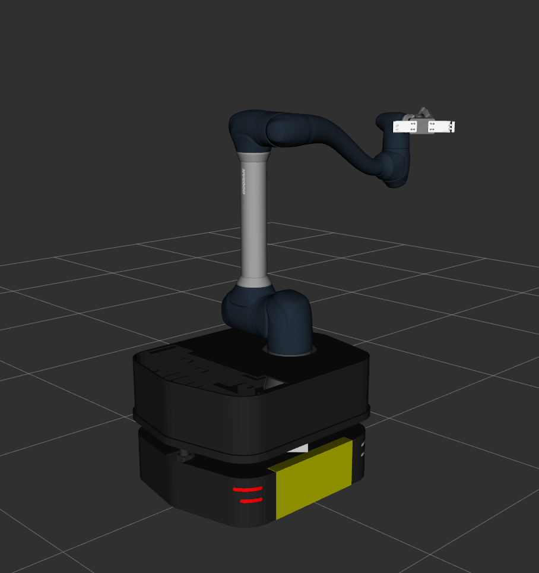

# unified_manipulation_config

A ROS 2 (Jazzy) workspace for **whole-body motion planning and control** of a mobile manipulator using [MoveIt 2](https://moveit.ros.org/) and [ros2_control](https://control.ros.org/). The platform, **Reachback**, pairs a [Clearpath Ridgeback](https://clearpathrobotics.com/ridgeback-indoor-robot-platform/) omnidirectional base with a [Doosan H2017](https://www.doosanrobotics.com/en/product-solutions/product/h-series/h2017/) 6-DOF industrial arm and an [OnRobot 2FG14](https://onrobot.com/en/products/2fg14-finger-gripper), yielding a 9-DOF system (3 base + 6 arm) capable of whole-body motion planning.

## The Robot



The Reachback consists of a Doosan arm (coupled with the OnRobot gripper) mounted on the Ridgeback's top deck via a fixed joint.
A planar joint connects the `odom` frame to `base_link`, giving the planner translational and rotational freedom for the base.

The system runs in simulation using `mock_components/GenericSystem` hardware interfaces (no physical robot required).

## Repository Structure

```
src/
├── reachback_description/      # Composite URDF (base + arm + gripper)
├── reachback_moveit_config/    # MoveIt 2 config (SRDF, kinematics, controllers)
├── joint_to_twist_controller/  # ros2_control controller: world joint coordinates to base twist
├── mm_demo/                    # Mobile manipulation demos
├── pink_kinematics_server/     # Pink whole-body IK solver (ROS 2 service)
└── vendor/                     # Vendored dependencies (MoveIt Task Constructor and robot descriptions)
```

### Kinematics

**pink_kinematics_server** is a Python ROS 2 node wrapping the [Pink](https://github.com/stephane-caron/pink) inverse-kinematics library.
It solves whole-body IK as a quadratic program with configurable convergence tolerance, max iterations, and base-movement cost, and exposes a `GetPositionIK` service consumed by MoveIt's `SrvKinematicsPlugin`.
It requires [these](https://github.com/moveit/moveit2/pull/3702) [two](https://github.com/moveit/moveit2/pull/3704) MoveIt PRs for updates to `SrvKinematicsPlugin`.

### Controllers

**joint_to_twist_controller** is a custom ros2_control `ChainableControllerInterface` that converts joint-level velocity commands (x, y, θ) in world frame from MoveIt's joint trajectory output into `geometry_msgs/Twist` messages in base frame for the mecanum drive controller.
This allows MoveIt to drive the base through the standard joint trajectory interface.

### Demos

To launch the RViz motion planning demo where you can drag the interactive marker to plan, use:

```bash
ros2 launch reachback_moveit_config moveit_rviz.launch
```
<video controls src="https://private-user-images.githubusercontent.com/10466537/596282691-f0aad0f5-ea79-4eea-8da5-02c63f699dde.mp4?jwt=eyJ0eXAiOiJKV1QiLCJhbGciOiJIUzI1NiJ9.eyJpc3MiOiJnaXRodWIuY29tIiwiYXVkIjoicmF3LmdpdGh1YnVzZXJjb250ZW50LmNvbSIsImtleSI6ImtleTUiLCJleHAiOjE3NzkzODkyMTksIm5iZiI6MTc3OTM4ODkxOSwicGF0aCI6Ii8xMDQ2NjUzNy81OTYyODI2OTEtZjBhYWQwZjUtZWE3OS00ZWVhLThkYTUtMDJjNjNmNjk5ZGRlLm1wND9YLUFtei1BbGdvcml0aG09QVdTNC1ITUFDLVNIQTI1NiZYLUFtei1DcmVkZW50aWFsPUFLSUFWQ09EWUxTQTUzUFFLNFpBJTJGMjAyNjA1MjElMkZ1cy1lYXN0LTElMkZzMyUyRmF3czRfcmVxdWVzdCZYLUFtei1EYXRlPTIwMjYwNTIxVDE4NDE1OVomWC1BbXotRXhwaXJlcz0zMDAmWC1BbXotU2lnbmF0dXJlPTU5NmEwNzQ1NmNkMzczNjI1OTkzNzYwOTExOWE5NmRkMWE3MjA4MWE3NTQ0YmEwZTIzMmNhYzA0MWZlNzk1OGEmWC1BbXotU2lnbmVkSGVhZGVycz1ob3N0JnJlc3BvbnNlLWNvbnRlbnQtdHlwZT12aWRlbyUyRm1wNCJ9.bj3HizFw9UnMlvS4tWfx-4c6YZfdfFLUUm2WA-e4JAU" title="Whole-body planning with interactive marker"></video>

This starts the robot state publisher, Pink IK server, MoveGroup, and RViz. You can use the interactive markers to drag the end-effector or base, then plan and execute motions from the MotionPlanning panel.

All other demos live in the **mm_demo** package.

| Demo | Description |
|---|---|
| **write_letters** | Plans Cartesian motions that trace out letter paths using the whole-body planner via MoveIt Task Constructor. |
| **draw_square** | Plans a square Cartesian trajectory at a configurable size with height variation. |

#### write_letters

This demo will write some letters in the air.

```bash
ros2 launch mm_demo cartesian_task.launch mode:=write_letters
```

<video controls src="https://private-user-images.githubusercontent.com/10466537/596282698-6a7ff505-34a5-4aed-af1b-77f23892f46e.mp4?jwt=eyJ0eXAiOiJKV1QiLCJhbGciOiJIUzI1NiJ9.eyJpc3MiOiJnaXRodWIuY29tIiwiYXVkIjoicmF3LmdpdGh1YnVzZXJjb250ZW50LmNvbSIsImtleSI6ImtleTUiLCJleHAiOjE3NzkzODkyMTksIm5iZiI6MTc3OTM4ODkxOSwicGF0aCI6Ii8xMDQ2NjUzNy81OTYyODI2OTgtNmE3ZmY1MDUtMzRhNS00YWVkLWFmMWItNzdmMjM4OTJmNDZlLm1wND9YLUFtei1BbGdvcml0aG09QVdTNC1ITUFDLVNIQTI1NiZYLUFtei1DcmVkZW50aWFsPUFLSUFWQ09EWUxTQTUzUFFLNFpBJTJGMjAyNjA1MjElMkZ1cy1lYXN0LTElMkZzMyUyRmF3czRfcmVxdWVzdCZYLUFtei1EYXRlPTIwMjYwNTIxVDE4NDE1OVomWC1BbXotRXhwaXJlcz0zMDAmWC1BbXotU2lnbmF0dXJlPWU4NjY5ODM1NTlmNmRlMzk5OTYwMmVjNmI2MTdkZjJmZDNlNzViMDc2N2IzMzVlOWY5MDkyZmY3NzVlM2I4NTUmWC1BbXotU2lnbmVkSGVhZGVycz1ob3N0JnJlc3BvbnNlLWNvbnRlbnQtdHlwZT12aWRlbyUyRm1wNCJ9.-nQIij_ak2YFeHzSsN8sgNUFKBm9PBewapc-Qbigw_o" title="Write letters"></video>

#### draw_square

This demo will draw an inclined square.

```bash
ros2 launch mm_demo cartesian_task.launch mode:=draw_square
```

<video controls src="https://private-user-images.githubusercontent.com/10466537/596282695-1c203d4b-23ed-4cf5-af19-32c841218f41.mp4?jwt=eyJ0eXAiOiJKV1QiLCJhbGciOiJIUzI1NiJ9.eyJpc3MiOiJnaXRodWIuY29tIiwiYXVkIjoicmF3LmdpdGh1YnVzZXJjb250ZW50LmNvbSIsImtleSI6ImtleTUiLCJleHAiOjE3NzkzODg4NTAsIm5iZiI6MTc3OTM4ODU1MCwicGF0aCI6Ii8xMDQ2NjUzNy81OTYyODI2OTUtMWMyMDNkNGItMjNlZC00Y2Y1LWFmMTktMzJjODQxMjE4ZjQxLm1wND9YLUFtei1BbGdvcml0aG09QVdTNC1ITUFDLVNIQTI1NiZYLUFtei1DcmVkZW50aWFsPUFLSUFWQ09EWUxTQTUzUFFLNFpBJTJGMjAyNjA1MjElMkZ1cy1lYXN0LTElMkZzMyUyRmF3czRfcmVxdWVzdCZYLUFtei1EYXRlPTIwMjYwNTIxVDE4MzU1MFomWC1BbXotRXhwaXJlcz0zMDAmWC1BbXotU2lnbmF0dXJlPWMxNzdjZjQwNjY0NmYyN2I4YzhmNzY4NDM1NjMxYjg2NDU4ZDlhYzdjMDYxOTE5MjRhNDMyNmMzMmY1M2Q2MjgmWC1BbXotU2lnbmVkSGVhZGVycz1ob3N0JnJlc3BvbnNlLWNvbnRlbnQtdHlwZT12aWRlbyUyRm1wNCJ9.xaK9qD2oi8ZaXiFHOwYV917gNfc-RVbU1SpZJC6vHIA" title="Draw square"></video>

## Set up

### Requirements

This project uses Docker to manage dependencies.
To install Docker:

1. Follow the official [Docker install instructions](https://docs.docker.com/engine/install/ubuntu/)
2. Follow the official [Docker post-installation steps](https://docs.docker.com/engine/install/linux-postinstall/)
3. Install Docker Compose: `sudo apt install docker-compose-plugin`

> Note:
> This repository requires a patched version of MoveIt and joint trajectory controller version >= 4.40
> We provide pre-built images (one of MoveIt with patches and one purpose-built for the unified_manipulation_config_ws) so you can avoid building these dependencies yourself.
> The dependencies and patches are publicly available; you will need to build [ros2_controllers](https://github.com/ros-controls/ros2_controllers/tree/4.40.0) and MoveIt with [these](https://github.com/moveit/moveit2/pull/3702) [changes](https://github.com/moveit/moveit2/pull/3704) from source.

> The Docker setup assumes you're using NVIDIA graphics.

Run the setup script to create the .env file to capture your UID and GID.
You will only need to run this script once.
```
./set-up-container-user.sh
```

> Please note that this project uses dependencies that are not provided by rosdep!
> `rosdep install` will *not* be sufficient to install all depenendencies.
> If you would like to work outside of the Docker image, please see the [Dockerfile](./docker/Dockerfile) for a complete list of dependencies.

### Running the Docker Container

From the unified_manipulation_config_ws directory (`cd demos/unified_manipulation_config_ws`), start the container:
```
docker compose up -d
```

Then, exec into the container with:
```
./docker-compose-shell.sh
```

Optionally, if you'd like to build the container for yourself, before starting the container, run:
```
docker compose build
```

### Building

From inside the container, import dependencies:

```bash
vcs import --recursive src/vendor < mobile_manipulation.repos
```

Build packages up to the demos from the workspace root:

```bash
colcon build --symlink-install --packages-up-to mm_demo
source install/setup.bash
```

## Licenses

This project also contains components under the following licenses:

- Dev container CLI tooling: MIT (see [LICENSES/MIT-devcontainers-cli](./LICENSES/MIT-devcontainers-cli))

---

This demo was developed by the Rockwell Automation Robotics Center of Excellence.
