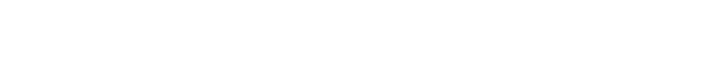

# Clearpath Community Demos

<figure class="aligncenter">
    
</figure>

Welcome to the **Clearpath Community Demos**, a collection of community-contributed
demos, examples, and tutorials for
[Clearpath Robotics, by Rockwell Automation](https://clearpathrobotics.com)
platforms — including Husky, Jackal, Dingo, Warthog, Ridgeback, and more.

This site documents demos that live in the
[`clearpath_community_demos`](https://github.com/clearpathrobotics/clearpath_community_demos)
repository. Each demo includes a written guide here as well as source code you
can clone, build, and run on your robot or in simulation.

> **Note:** Demos in this repository are contributed by the community and are
> not officially supported by Clearpath Robotics, by Rockwell Automation. They are provided as-is to
> help users get started and share what they have built.

> ## ⚠️ Use at your own risk
>
> The code in this repository can drive real robots. It has **not** been
> reviewed, tested, or certified by Clearpath Robotics, by Rockwell
> Automation, and comes with **no warranty of any kind** (see the
> [LICENSE](https://github.com/clearpathrobotics/clearpath_community_demos/blob/main/LICENSES/Apache2)).
> You are solely responsible for any consequences of running it — including
> damage to property, injury to people, or harm to your robot. Always:
>
> - Review the code before running it.
> - Test in simulation first.
> - Keep a clear path and a working e-stop within reach when running on
>   hardware.
> - Confirm the demo supports your platform and software version.

## Table of Contents


